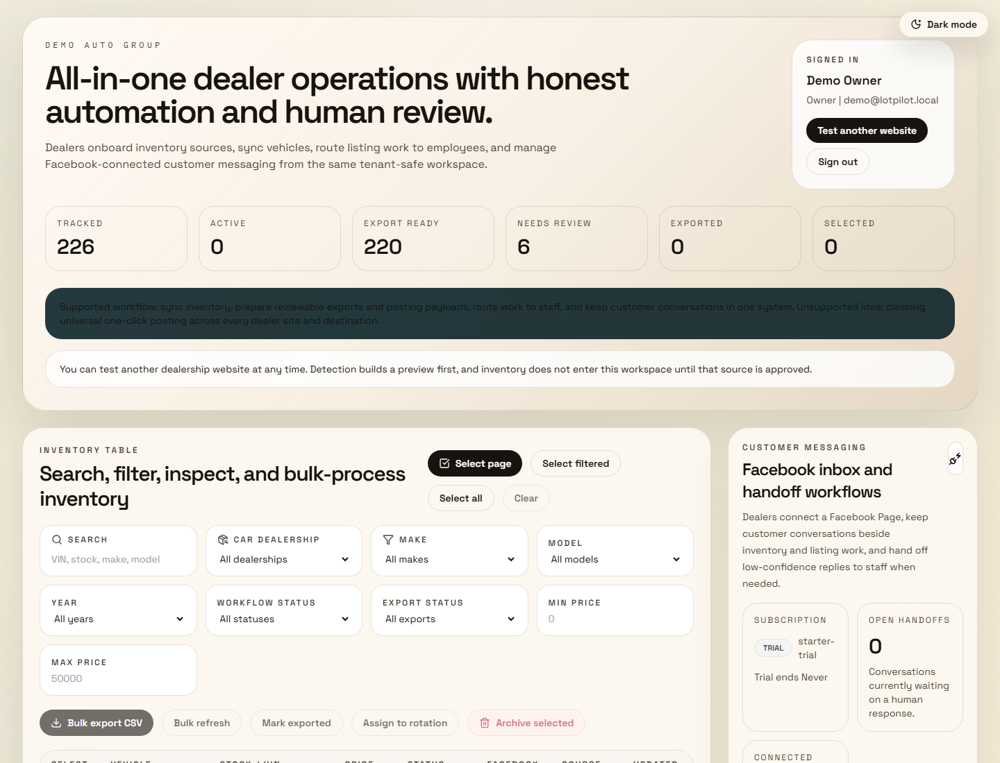
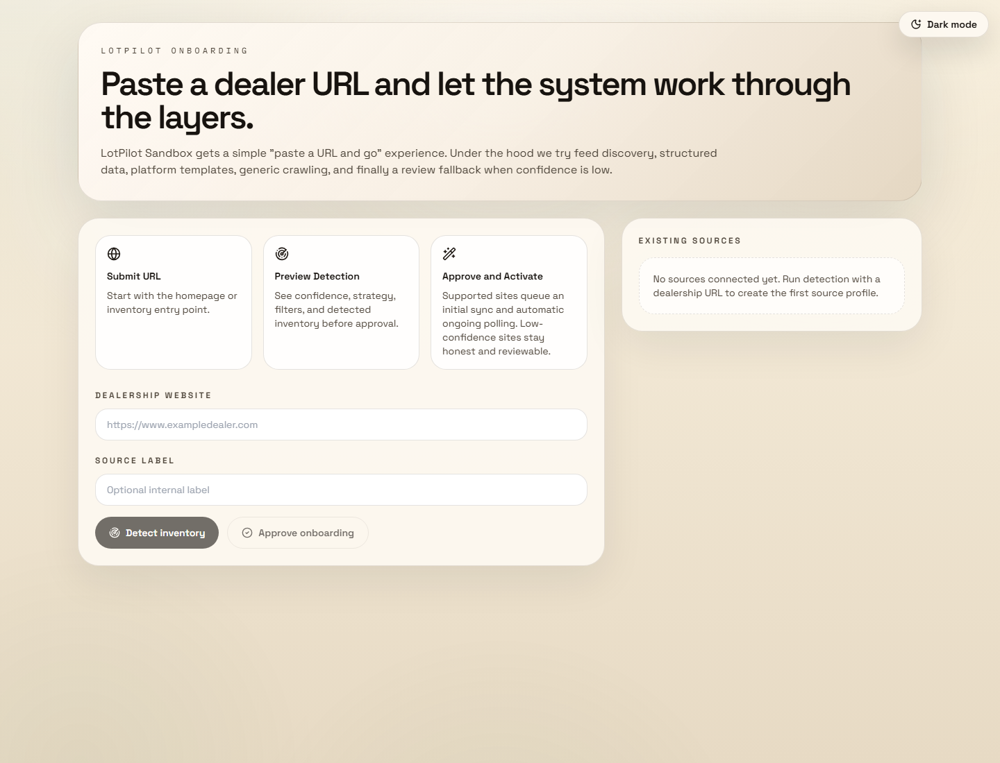
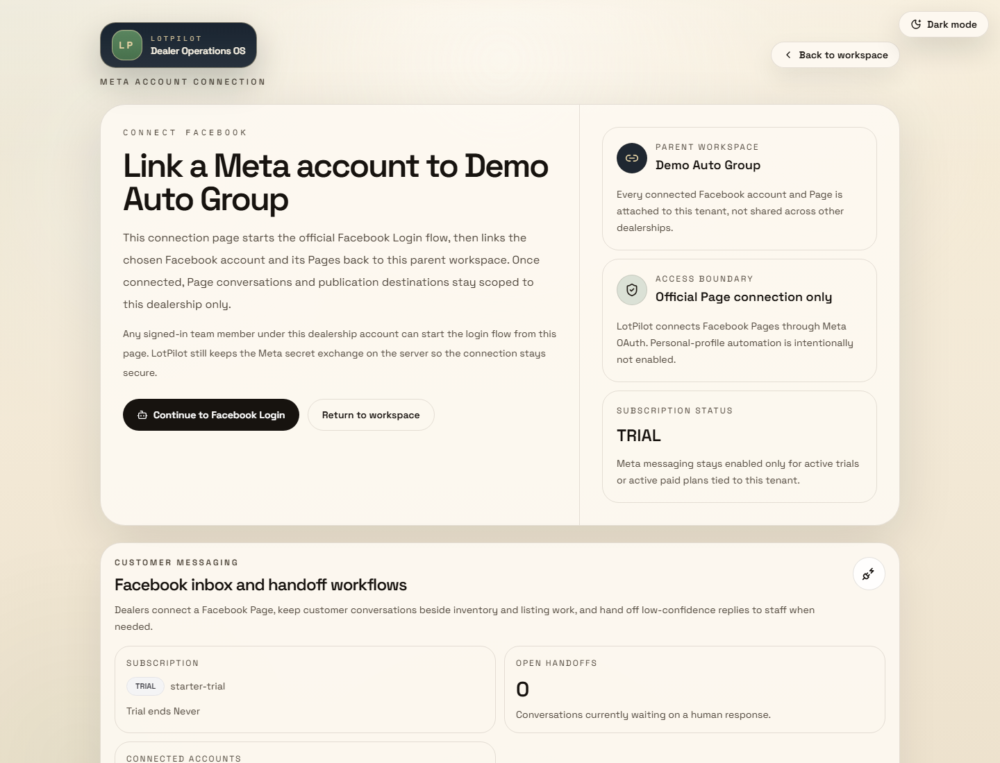
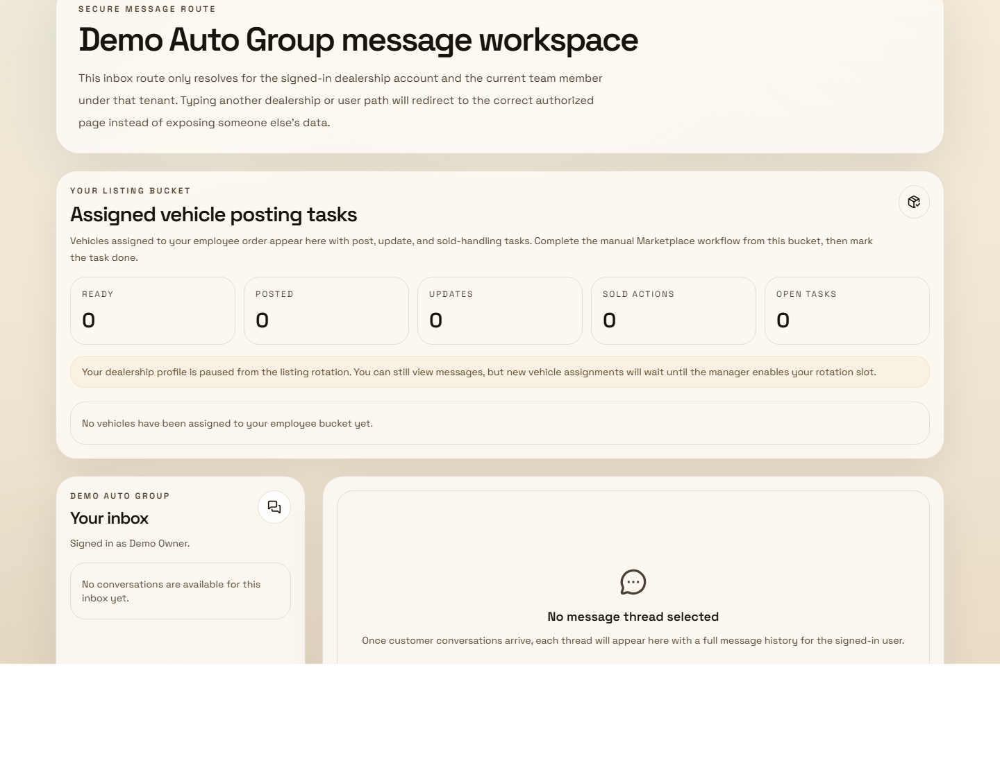

# LotPilot

LotPilot is an all-in-one dealer operations platform that combines inventory onboarding, listing operations, exports, and Facebook-connected customer messaging inside one tenant-safe workspace.

LotPilot brings together dealership site onboarding, inventory sync, employee listing workflows, reviewable posting payloads, and customer conversations without forcing teams to bounce between separate tools.

Instead of pretending one generic scraper can automate every dealer site, LotPilot uses layered detection and keeps low-confidence sources in review until they are ready. That "honest automation" approach is a core product decision.

## Screenshots

Live UI snapshots from a generic seeded LotPilot workspace:

| Dashboard | Onboarding |
| --- | --- |
|  |  |
|  |  |

## Why it reads like a real product

- Dealers paste a website URL and move through a guided onboarding flow with preview, confidence scoring, and approval.
- Inventory sync runs in the background with idempotency protection, retries, dead-letter handling, and health alerts.
- The dashboard supports filtering, bulk actions, exports, change history, snapshots, and source monitoring.
- Employees can be added to a round-robin listing workflow so review-ready vehicles move into manual posting queues.
- Facebook Page connections support inbox workflows, handoff states, and publication tracking at the tenant level.
- The data model is built around real SaaS concerns: multi-tenancy, RBAC, audit logs, background jobs, integrations, and operational history.

## Core product flows

### 1. Dealer onboarding

1. Paste a dealership URL.
2. Run layered detection across feed discovery, structured data, platform templates, and generic crawling.
3. Preview detected inventory with confidence and strategy metadata.
4. Approve supported sources or keep low-confidence results in review.

### 2. Inventory and review operations

- Scheduled and manual source syncs
- Tenant-scoped vehicle search and filtering
- Bulk archive, refresh, export, and mark-exported actions
- Snapshot history and change-event tracking
- Source health metrics and alerts

### 3. Employee listing workflow

- Employee roster management
- Round-robin assignment of unassigned vehicles
- Listing task creation for ready-to-post, update, and sold actions
- Per-user listing buckets inside secure workspace routes

### 4. Messaging and publication workflow

- Facebook Page connection through Meta OAuth
- Tenant-scoped Messenger conversations
- AI reply support with human handoff fallback
- Vehicle publication tracking and downstream posting prep

## Tech stack

- Next.js App Router
- TypeScript
- Prisma
- PostgreSQL
- Auth.js
- Playwright
- pg-boss
- Zod
- Tailwind CSS

## Data model

LotPilot uses a multi-tenant PostgreSQL schema that tracks:

- tenants, users, memberships, and subscriptions
- inventory sources, source profiles, detection runs, extraction rules, and field mappings
- vehicles, images, snapshots, and change events
- sync runs, health metrics, alerts, background jobs, and export jobs
- Facebook auth accounts, messaging connections, conversations, messages, and handoff tasks
- employee listing assignments, listing tasks, and audit logs

The full schema lives in [prisma/schema.prisma](prisma/schema.prisma).

## Architecture notes

- Source detection is intentionally layered so supported sites can activate quickly while uncertain sites stay reviewable.
- Inventory sync and export workflows are queued through `pg-boss` and recorded in the database for retries, auditing, and operational visibility.
- Tenant isolation is enforced across auth, dashboard queries, downloads, messaging routes, and audit records.
- Inventory changes cascade into downstream workflows such as publication updates, sold actions, employee listing tasks, and customer-facing messaging context.

Helpful implementation entry points:

- [src/components/onboarding-wizard.tsx](src/components/onboarding-wizard.tsx)
- [src/components/inventory-dashboard.tsx](src/components/inventory-dashboard.tsx)
- [src/lib/services/inventory-service.ts](src/lib/services/inventory-service.ts)

## Local setup

1. Copy `.env.example` to `.env`.
2. Start PostgreSQL and point `DATABASE_URL` at your database.
3. Install dependencies with `npm install`.
4. Generate the Prisma client and push the schema:

```bash
npm run db:generate
npm run db:push
```

5. Optionally seed a demo owner workspace:

```bash
npm run seed:admin
```

6. Install the Playwright browser:

```bash
npx playwright install chromium
```

7. Start the app and worker:

```bash
npm run worker
npm run dev
```

Optional helpers:

```bash
npm run schedule:jobs
npm run sync:inventory
```

## Verification

Verified in this environment:

- `npx prisma validate`
- `npx prisma generate`
- `npm run lint`
- `npm run build`

Source-detection verification was also run against a live public dealership website during local testing, where the current adapter resolved a high-confidence `PLATFORM_TEMPLATE` match and returned a sample vehicle preview.
